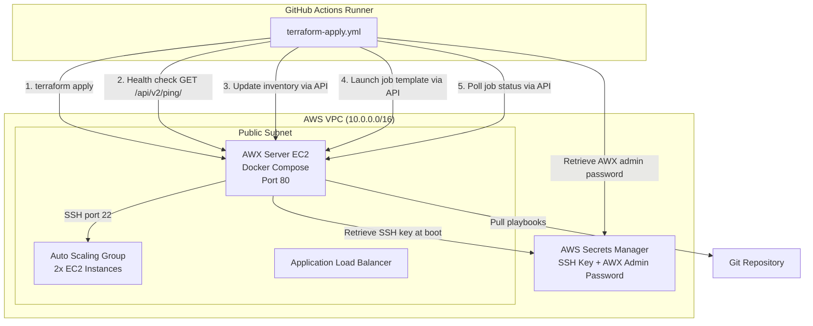
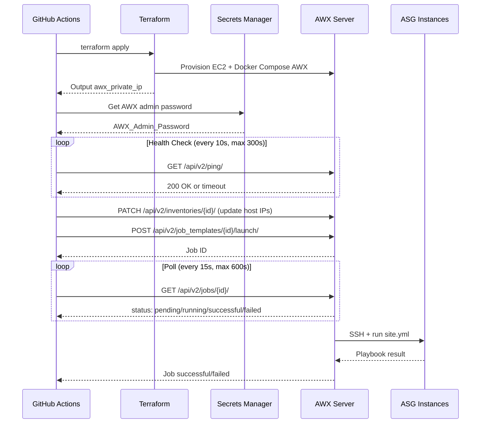

# Design Document: AWX Integration

## Overview

This design replaces the direct `ansible-playbook` execution in the GitHub Actions pipeline with an AWX server managed by Terraform. A new `modules/awx/` Terraform module provisions an EC2 instance running AWX via Docker Compose. The GitHub Actions `terraform-apply.yml` workflow is modified to: (1) remove the "Generate Ansible inventory from ASG" and "Run Ansible Playbook" steps, (2) add steps that health-check the AWX API, update the AWX inventory with current ASG instance IPs, and launch a job template via the AWX REST API, and (3) poll for job completion. The existing `ansible/playbooks/site.yml` is reused without modification inside AWX.

The AWX admin password and SSH private key remain in AWS Secrets Manager. The pipeline retrieves the AWX admin password at runtime to authenticate API calls. AWX itself retrieves the SSH key during provisioning to configure a Machine credential. No secrets are stored in GitHub.

### Key Design Decisions

1. **Docker Compose deployment on a single EC2 instance** — AWX is deployed via the official `awx-on-k3s` or Docker Compose method. For a learning/dev environment, a single EC2 instance with Docker Compose is simpler and cheaper than a Kubernetes cluster. The user_data script handles the full installation.

2. **AWX configuration via user_data bootstrap script** — AWX resources (project, credential, inventory, job template) are configured by a bootstrap script that runs after AWX starts. This avoids a dependency on a separate Terraform AWX provider and keeps the configuration self-contained in the module.

3. **Private IP only for AWX** — AWX is accessed exclusively via its private IP within the VPC. The GitHub Actions runner reaches AWX through the VPC because the runner has AWS credentials and uses the AWX private IP (the runner connects from within the AWS network via the OIDC-assumed role). Since the existing subnets are public subnets with public IPs, the AWX instance will have a public IP for outbound internet access (to pull Git repos and Docker images), but the security group blocks all inbound traffic from the public internet.

4. **Enable/disable toggle** — A `enable_awx` variable allows the AWX module to be conditionally provisioned, so the infrastructure can be deployed without AWX if needed.

## Architecture



### Sequence: Pipeline AWX Job Execution



## Components and Interfaces

### 1. AWX Terraform Module (`modules/awx/`)

**Files:**
- `modules/awx/main.tf` — EC2 instance, security group, IAM instance profile
- `modules/awx/variables.tf` — Input variables
- `modules/awx/outputs.tf` — Module outputs
- `modules/awx/templates/user_data.sh.tpl` — Templatefile for EC2 user_data bootstrap

**Input Variables:**

| Variable | Type | Description |
|---|---|---|
| `environment` | `string` | Environment name (e.g., "terraformtest") |
| `vpc_id` | `string` | VPC ID for security group and instance placement |
| `subnet_id` | `string` | Subnet ID for the AWX EC2 instance |
| `vpc_cidr` | `string` | VPC CIDR for security group inbound rules |
| `instance_type` | `string` | EC2 instance type (default: `t3.medium`) |
| `ec2_security_group_id` | `string` | Compute ASG instance security group ID (for SSH egress rule) |
| `awx_admin_password_secret_id` | `string` | Secrets Manager secret ID for AWX admin password |
| `ssh_private_key_secret_id` | `string` | Secrets Manager secret ID for SSH private key |
| `awx_project_git_url` | `string` | Git repository URL for the AWX project |
| `key_pair_name` | `string` | Existing EC2 key pair name for SSH access to AWX instance |
| `tags` | `map(string)` | Resource tags |

**Outputs:**

| Output | Description |
|---|---|
| `awx_private_ip` | Private IP of the AWX EC2 instance |
| `awx_instance_id` | Instance ID of the AWX EC2 instance |
| `awx_security_group_id` | Security group ID of the AWX instance |

### 2. AWX Security Group

Defined within `modules/awx/main.tf`:

| Rule | Direction | Port | Protocol | Source/Destination | Purpose |
|---|---|---|---|---|---|
| Inbound | Ingress | 80 | TCP | VPC CIDR | AWX Web UI / API |
| Inbound | Ingress | 443 | TCP | VPC CIDR | HTTPS access |
| Outbound | Egress | 22 | TCP | EC2 instance SG | SSH to target instances |
| Outbound | Egress | 443 | TCP | 0.0.0.0/0 | Git repos, container registries |

Additionally, the existing `compute-asg` module's security group needs a new ingress rule allowing SSH (port 22) from the AWX security group. This is added as an `aws_security_group_rule` resource in the AWX module (or in the environment config) to avoid circular module dependencies.

### 3. AWX Bootstrap Script (`user_data.sh.tpl`)

The user_data script runs on first boot and:

1. Installs Docker and Docker Compose
2. Pulls and starts AWX containers via Docker Compose
3. Waits for AWX API to become available locally
4. Retrieves the SSH private key from Secrets Manager
5. Configures AWX resources via the AWX CLI (`awx`) or REST API:
   - Creates an **Organization** (default)
   - Creates an **SCM Credential** for Git (if private repo) or uses no credential (public repo)
   - Creates a **Project** pointing to the Git repository
   - Creates a **Machine Credential** with the SSH private key and `ec2-user` username
   - Creates an **Inventory** named `dev-inventory` with a host group `dev_instances`
   - Creates a **Job Template** named `site-yml` referencing the project, inventory, credential, and `ansible/playbooks/site.yml` playbook with `become: true`
6. Syncs the project to pull playbooks from Git

### 4. Environment Configuration Changes (`environments/dev-github/`)

**main.tf additions:**

```hcl
module "awx" {
  count  = var.enable_awx ? 1 : 0
  source = "../../modules/awx"

  environment                  = var.environment
  vpc_id                       = module.networking.vpc_id
  subnet_id                    = module.networking.public_subnet_ids[0]
  vpc_cidr                     = var.vpc_cidr
  instance_type                = var.awx_instance_type
  ec2_security_group_id        = module.compute_asg.security_group_id
  awx_admin_password_secret_id = var.awx_admin_password_secret_id
  ssh_private_key_secret_id    = var.ssh_private_key_secret_id
  awx_project_git_url          = var.awx_project_git_url
  key_pair_name                = "${var.environment}-key"
  tags                         = var.tags
}
```

**New variables in `variables.tf`:**

```hcl
variable "enable_awx" {
  description = "Enable AWX server provisioning"
  type        = bool
  default     = false
}

variable "awx_instance_type" {
  description = "EC2 instance type for AWX server"
  type        = string
  default     = "t3.medium"
}

variable "awx_admin_password_secret_id" {
  description = "Secrets Manager secret ID for AWX admin password"
  type        = string
  default     = "awx/admin-password"
}

variable "ssh_private_key_secret_id" {
  description = "Secrets Manager secret ID for SSH private key used by AWX"
  type        = string
  default     = "terraform/ssh-private-key"
}

variable "awx_project_git_url" {
  description = "Git repository URL for AWX project containing Ansible playbooks"
  type        = string
  default     = ""
}
```

**New outputs in `outputs.tf`:**

```hcl
output "awx_private_ip" {
  description = "Private IP of the AWX server"
  value       = var.enable_awx ? module.awx[0].awx_private_ip : ""
}
```

### 5. GitHub Actions Workflow Changes (`terraform-apply.yml`)

The `apply` job is modified as follows:

**Removed steps:**
- "Generate Ansible inventory from ASG"
- "Run Ansible Playbook"
- SSH private key retrieval in the apply job (retained in plan job for Terraform key pair)

**Retained steps:**
- SSH public key retrieval (needed for Terraform EC2 key pair provisioning)
- "Wait for ASG instances to be ready"

**New steps (after "Wait for ASG instances to be ready"):**

1. **Retrieve AWX Admin Password** — Fetches the AWX admin password from Secrets Manager
2. **Wait for AWX Health** — Polls `GET http://{awx_private_ip}/api/v2/ping/` every 10 seconds for up to 300 seconds
3. **Update AWX Inventory** — Sends the current ASG instance private IPs to AWX via the API to update the `dev_instances` host group
4. **Launch AWX Job** — `POST /api/v2/job_templates/{name}/launch/` with extra variables
5. **Poll Job Status** — Polls `GET /api/v2/jobs/{id}/` every 15 seconds for up to 600 seconds, logging status updates
6. **Handle Completion** — On success: log and continue. On failure/error: retrieve job stdout, log it, exit 1. On timeout: exit 1 with timeout message.

**New job outputs:**
- `awx_private_ip` from Terraform outputs

### 6. SSH Ingress Rule for Compute ASG

An `aws_security_group_rule` resource is added (in the environment config or AWX module) to allow inbound SSH from the AWX security group to the compute ASG security group:

```hcl
resource "aws_security_group_rule" "asg_ssh_from_awx" {
  count                    = var.enable_awx ? 1 : 0
  type                     = "ingress"
  from_port                = 22
  to_port                  = 22
  protocol                 = "tcp"
  security_group_id        = module.compute_asg.security_group_id
  source_security_group_id = module.awx[0].awx_security_group_id
  description              = "SSH from AWX server"
}
```

## Data Models

### AWX API Resources (configured by bootstrap script)

**Organization:**
```json
{
  "name": "Default"
}
```

**Project:**
```json
{
  "name": "{environment}-ansible-project",
  "scm_type": "git",
  "scm_url": "{awx_project_git_url}",
  "scm_branch": "main",
  "scm_update_on_launch": true
}
```

**Machine Credential:**
```json
{
  "name": "{environment}-ssh-credential",
  "credential_type": "Machine",
  "inputs": {
    "username": "ec2-user",
    "ssh_key_data": "{ssh_private_key_from_secrets_manager}"
  }
}
```

**Inventory:**
```json
{
  "name": "dev-inventory",
  "organization": "Default"
}
```

**Inventory Host Group:**
```json
{
  "name": "dev_instances"
}
```

**Inventory Hosts (updated by pipeline):**
```json
{
  "name": "instance_1",
  "variables": {
    "ansible_host": "{private_ip}",
    "ansible_user": "ec2-user"
  }
}
```

**Job Template:**
```json
{
  "name": "site-yml",
  "project": "{project_id}",
  "playbook": "ansible/playbooks/site.yml",
  "inventory": "{inventory_id}",
  "credential": "{credential_id}",
  "become_enabled": true,
  "ask_variables_on_launch": true
}
```

### Terraform State Additions

The following new resources are added to the Terraform state when `enable_awx = true`:

- `module.awx[0].aws_instance.awx` — AWX EC2 instance
- `module.awx[0].aws_security_group.awx` — AWX security group
- `module.awx[0].aws_security_group_rule.*` — SG rules (inbound 80, 443, outbound 22, 443)
- `module.awx[0].aws_iam_instance_profile.awx` — Instance profile for Secrets Manager access
- `module.awx[0].aws_iam_role.awx` — IAM role for the AWX instance
- `module.awx[0].aws_iam_role_policy.awx_secrets` — Policy allowing Secrets Manager read
- `aws_security_group_rule.asg_ssh_from_awx[0]` — SSH ingress on compute ASG SG

### Secrets Manager Entries

| Secret ID | Content | Used By |
|---|---|---|
| `terraform/ssh-private-key` | SSH private key (existing) | AWX bootstrap (Machine credential) |
| `terraform/ssh-public-key` | SSH public key (existing) | Terraform EC2 key pair |
| `awx/admin-password` | AWX admin password (new) | Pipeline API auth, AWX bootstrap |


## Correctness Properties

*A property is a characteristic or behavior that should hold true across all valid executions of a system — essentially, a formal statement about what the system should do. Properties serve as the bridge between human-readable specifications and machine-verifiable correctness guarantees.*

### Property 1: AWX security group ingress rules only allow VPC CIDR

*For any* ingress rule defined in the AWX security group Terraform configuration, the source CIDR or source security group must reference the VPC CIDR variable — never `0.0.0.0/0`. Additionally, the only allowed inbound ports are 80 and 443.

**Validates: Requirements 2.2, 2.3, 2.6**

### Property 2: Pipeline does not handle SSH private keys for Ansible execution

*For any* step in the `apply` job of the `terraform-apply.yml` workflow (after AWX integration), the step must not contain `ssh-private-key` retrieval commands used for Ansible execution. The SSH private key retrieval in the plan job (for Terraform key pair) is excluded from this check.

**Validates: Requirements 6.5, 12.3**

### Property 3: AWX job polling state machine correctness

*For any* sequence of AWX job status responses (drawn from "pending", "running", "successful", "failed", "error"), the polling function shall: (a) continue polling while status is "pending" or "running", (b) return success when status is "successful", (c) return failure when status is "failed" or "error", and (d) return timeout failure if the total elapsed time exceeds 600 seconds regardless of status.

**Validates: Requirements 10.1, 10.2, 10.3, 10.4, 10.5**

### Property 4: AWX health check retry logic correctness

*For any* sequence of health check responses (success or failure), the health check function shall: (a) retry every 10 seconds on failure, (b) return success on the first successful response, and (c) return timeout failure if no successful response is received within 300 seconds.

**Validates: Requirements 11.2, 11.3**

### Property 5: Zero AWX secrets in GitHub workflow files

*For any* generated secret name, no workflow file in `.github/workflows/` shall contain a `secrets.*` reference for AWX-related configuration. All AWX configuration values (admin password secret name, job template name, AWX server IP) must be sourced from `vars.*` context, Terraform outputs, or hardcoded non-sensitive identifiers.

**Validates: Requirements 14.1, 14.2, 14.4**

## Error Handling

### Terraform Provisioning Errors

| Error Scenario | Handling |
|---|---|
| AWX EC2 instance fails to launch | Terraform apply fails with standard error. No special handling needed — Terraform reports the failure. |
| Security group creation fails (e.g., duplicate name) | Terraform apply fails. The `environment` prefix ensures unique naming. |
| IAM role/policy creation fails (permissions) | Terraform apply fails. The GitHub OIDC role must have `iam:CreateRole`, `iam:PutRolePolicy`, `iam:CreateInstanceProfile` permissions. |
| Secrets Manager secret does not exist | User_data script fails during bootstrap. AWX instance will be running but unconfigured. Health check will timeout in the pipeline. |

### AWX Bootstrap Errors (user_data)

| Error Scenario | Handling |
|---|---|
| Docker installation fails | AWX containers won't start. Health check in pipeline will timeout after 300s with descriptive error. |
| AWX containers fail to start | Same as above — health check timeout. User can SSH to AWX instance and check `/var/log/cloud-init-output.log`. |
| Secrets Manager retrieval fails in user_data | Bootstrap script logs the error. AWX starts but without credentials configured. Job launch will fail with credential error. |
| Git project sync fails | AWX reports sync failure in its UI/API. Job template launch will fail because playbook is unavailable. Pipeline logs the AWX error response. |
| AWX API not available after container start | Bootstrap script retries AWX API availability with a local loop before configuring resources. If AWX never comes up, health check in pipeline catches it. |

### Pipeline Runtime Errors

| Error Scenario | Handling |
|---|---|
| AWX admin password retrieval fails | Pipeline step fails with `set -e`. Workflow terminates with non-zero exit code. Error message: "Failed to retrieve AWX admin password from Secrets Manager". |
| AWX health check timeout (300s) | Pipeline exits with code 1 and message: "AWX server did not become healthy within 300 seconds". |
| AWX API authentication failure (401) | Pipeline logs the HTTP status and response body, exits with code 1. |
| AWX job launch fails (API error) | Pipeline logs the HTTP status and error response body from AWX API, exits with code 1. |
| AWX job fails (playbook error) | Pipeline retrieves job stdout via `GET /api/v2/jobs/{id}/stdout/?format=txt`, logs it to GitHub Actions, exits with code 1. |
| AWX job timeout (600s) | Pipeline exits with code 1 and message: "AWX job did not complete within 600 seconds". |
| AWX inventory update fails | Pipeline logs the error response, exits with code 1. Job is not launched. |
| Network connectivity issue (runner to AWX) | curl/HTTP calls fail. Pipeline step fails with connection error, exits with code 1. |

### Error Handling Patterns in Workflow Scripts

All AWX-related workflow steps use:
```bash
set -euo pipefail
```

HTTP calls check response codes explicitly:
```bash
HTTP_CODE=$(curl -s -o response.json -w "%{http_code}" ...)
if [ "$HTTP_CODE" -ne 200 ]; then
  echo "::error::AWX API returned HTTP $HTTP_CODE"
  cat response.json
  exit 1
fi
```

## Testing Strategy

### Dual Testing Approach

This feature uses both unit tests and property-based tests:

- **Unit tests** verify specific examples: module file structure, bootstrap script content, workflow step presence/absence, and AWX resource configuration details.
- **Property-based tests** verify universal properties: security group rules never allow public internet ingress, polling logic handles all status sequences correctly, health check retry logic respects timeouts, and zero secrets appear in workflow files.

Both are complementary — unit tests catch concrete configuration bugs, property tests verify general correctness across all inputs.

### Property-Based Testing Configuration

- **Library:** `fast-check` (already in use in the project via `tests/package.json`)
- **Framework:** `vitest` (already configured in `tests/vitest.config.ts`)
- **Minimum iterations:** 100 per property test (`{ numRuns: 100 }`)
- **Tag format:** `Feature: awx-integration, Property {number}: {property_text}`
- **Each correctness property is implemented by a single property-based test**

### Test Files

| File | Type | Properties/Tests |
|---|---|---|
| `tests/property/awx-sg-ingress.property.test.ts` | Property | Property 1: AWX SG ingress rules only allow VPC CIDR |
| `tests/property/awx-no-ssh-keys.property.test.ts` | Property | Property 2: Pipeline does not handle SSH private keys |
| `tests/property/awx-job-polling.property.test.ts` | Property | Property 3: AWX job polling state machine |
| `tests/property/awx-health-check.property.test.ts` | Property | Property 4: AWX health check retry logic |
| `tests/property/awx-zero-secrets.property.test.ts` | Property | Property 5: Zero AWX secrets in workflow |
| `tests/unit/awx-module-structure.test.ts` | Unit | Module file structure, variables, outputs |
| `tests/unit/awx-bootstrap.test.ts` | Unit | Bootstrap script content checks |
| `tests/unit/awx-workflow.test.ts` | Unit | Workflow step presence/absence, ordering |

### Unit Test Coverage

Unit tests cover the example-testable acceptance criteria:
- AWX module file structure (1.2, 1.5, 1.6, 1.7)
- User_data template contains Docker Compose setup (1.3)
- Bootstrap script configures AWX resources: project (5.1, 5.2), credential (6.1, 6.2, 6.3), inventory (7.1, 7.5), job template (8.1-8.5)
- Workflow contains health check before job launch (11.1)
- Workflow removes old Ansible steps (12.1, 12.2)
- Workflow retains SSH public key retrieval (12.4)
- Environment config includes AWX module (13.1-13.5)
- AWX private IP derived from Terraform outputs (14.3)
