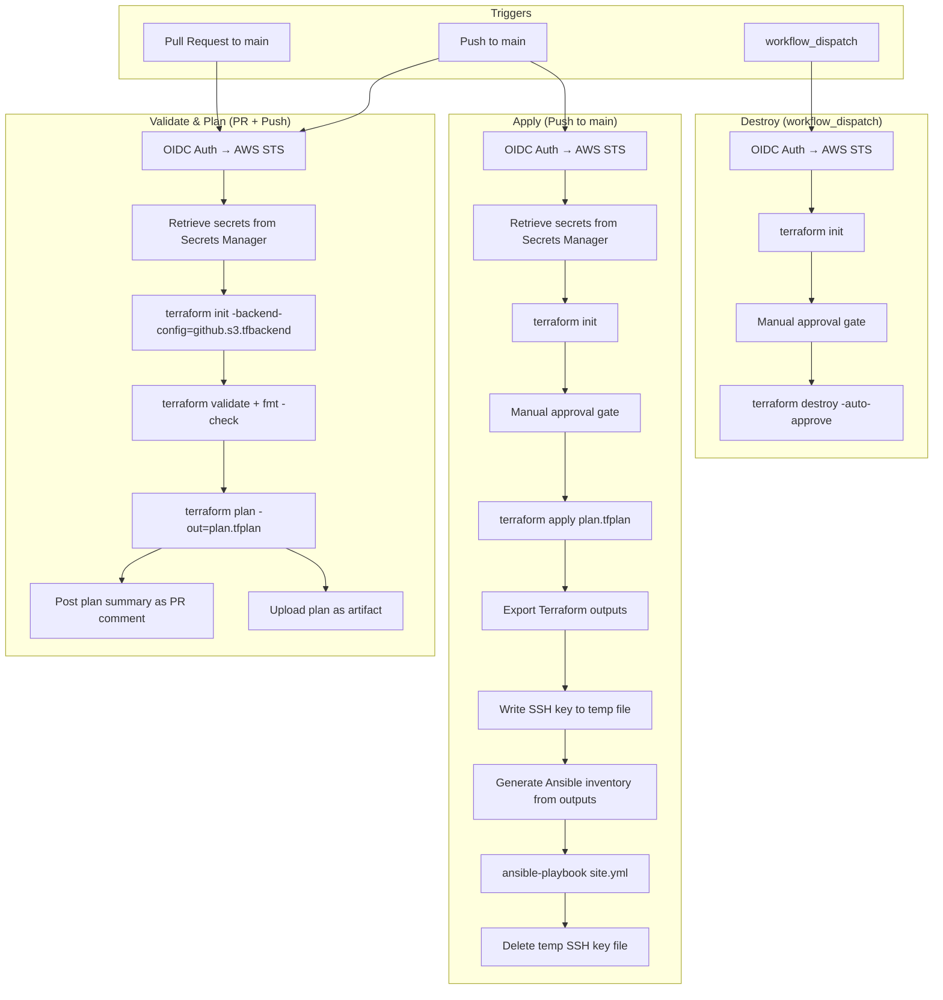
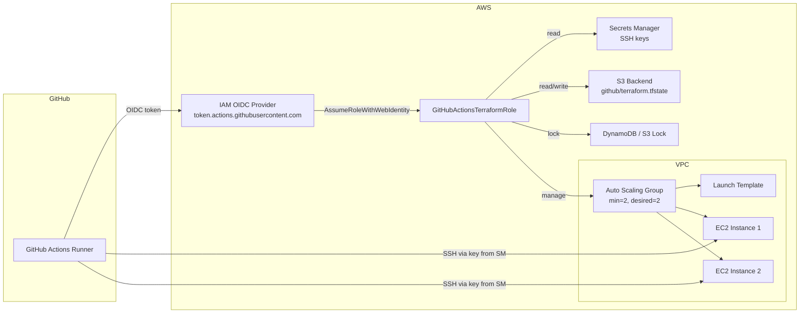

# Design Document: GitHub Actions CI/CD Pipeline

## Overview

This design introduces a GitHub Actions CI/CD pipeline that coexists alongside the existing GitLab CI/CD pipeline. The pipeline authenticates to AWS exclusively via GitHub OIDC federation (zero secrets in GitHub), retrieves all sensitive values from AWS Secrets Manager at runtime, manages Terraform state in a dedicated S3 backend, and orchestrates Terraform + Ansible workflows to provision and configure EC2 instances in an Auto Scaling Group.

The pipeline is implemented as a set of GitHub Actions workflow YAML files under `.github/workflows/`. It reuses the existing Terraform modules (`compute`, `networking`, `storage`, `cloudwatch`) and Ansible playbooks (`ansible/playbooks/site.yml`) without modification. New Terraform resources are introduced only where the GitHub Actions path requires them (IAM OIDC provider, GitHub-specific IAM role, S3 backend for GitHub state, and a launch template / ASG to replace the current `aws_instance` count-based approach for the GitHub deployment path).

### Key Design Decisions

1. **Separate S3 backend key** — The GitHub pipeline uses a distinct state key (`github/terraform.tfstate`) in the same or a separate S3 bucket to avoid state conflicts with GitLab.
2. **Separate IAM role** — A new `GitHubActionsTerraformRole` with its own OIDC trust policy isolates GitHub permissions from the existing `GitLabTerraformRole`.
3. **ASG instead of count-based instances** — Requirement 8 mandates an Auto Scaling Group. A new `compute-asg` module (or an extension of the existing compute module) provides a launch template + ASG. The existing `compute` module remains untouched for GitLab.
4. **Backend override via `-backend-config`** — The `versions.tf` backend block is changed to `backend "s3" {}` (empty) so both GitLab (http) and GitHub (s3) can supply their own backend config at `terraform init` time. Alternatively, a separate environment directory (`environments/dev-github/`) can be created to avoid touching the GitLab path entirely.
5. **Ansible runs in the same workflow job** — After `terraform apply`, the pipeline writes the SSH key to a temp file, generates the inventory from Terraform outputs, and runs `ansible-playbook` in the same runner. No separate Ansible job is needed since the runner already has AWS credentials.

## Architecture

### High-Level Pipeline Flow



### AWS Resource Architecture




## Components and Interfaces

### 1. GitHub Actions Workflow Files

| File | Trigger | Purpose |
|------|---------|---------|
| `.github/workflows/terraform-plan.yml` | `pull_request` (main), `push` (main) | Validate, format-check, plan, post PR comment |
| `.github/workflows/terraform-apply.yml` | `push` (main) | Plan, manual approval, apply, Ansible run |
| `.github/workflows/terraform-destroy.yml` | `workflow_dispatch` | Manual approval, destroy |

All three workflows share a common OIDC authentication step and secrets retrieval step, implemented as reusable composite actions or repeated step blocks.

#### Path Filters (all workflows)

```yaml
paths:
  - 'environments/**'
  - 'modules/**'
  - 'ansible/**'
```

### 2. IAM Resources (Terraform or manual setup)

| Resource | Description |
|----------|-------------|
| `aws_iam_openid_connect_provider` | GitHub OIDC provider (`token.actions.githubusercontent.com`) |
| `GitHubActionsTerraformRole` | IAM role with OIDC trust policy scoped to the GitHub repo |
| `github-terraform-permissions` policy | Permissions for EC2, ASG, VPC, S3, CloudWatch, SNS, IAM (GetRole/PassRole), Secrets Manager, KMS |

#### Trust Policy (GitHub OIDC)

```json
{
  "Version": "2012-10-17",
  "Statement": [
    {
      "Effect": "Allow",
      "Principal": {
        "Federated": "arn:aws:iam::ACCOUNT_ID:oidc-provider/token.actions.githubusercontent.com"
      },
      "Action": "sts:AssumeRoleWithWebIdentity",
      "Condition": {
        "StringLike": {
          "token.actions.githubusercontent.com:sub": "repo:OWNER/REPO:ref:refs/heads/main"
        },
        "StringEquals": {
          "token.actions.githubusercontent.com:aud": "sts.amazonaws.com"
        }
      }
    }
  ]
}
```

### 3. S3 Backend Configuration

A new backend config file `environments/dev/github.s3.tfbackend`:

```hcl
bucket       = "multivar-databricks-chiottcbucket"
key          = "github/terraform.tfstate"
region       = "us-east-1"
use_lockfile = true
```

The `versions.tf` backend block must support both GitLab (`http`) and GitHub (`s3`). Two approaches:

- **Option A (recommended):** Create a separate environment directory `environments/dev-github/` with `backend "s3" {}` in its `versions.tf`. This avoids any changes to the GitLab path.
- **Option B:** Change the existing `versions.tf` to `backend "s3" {}` and have both pipelines supply backend config via `-backend-config`. GitLab would need to switch to S3 backend as well.

Design choice: **Option A** — a new `environments/dev-github/` directory that symlinks or copies module references, with its own `versions.tf` using `backend "s3" {}`.

### 4. Compute ASG Module / Launch Template

The existing `modules/compute` uses `aws_instance` with `count`. For the GitHub Actions path, Requirement 8 mandates an Auto Scaling Group. Two approaches:

- **Option A:** Add ASG resources to the existing `modules/compute` behind a feature flag variable.
- **Option B (recommended):** Create a new `modules/compute-asg/` module with launch template + ASG resources. The `environments/dev-github/main.tf` references this module instead of `modules/compute`.

Design choice: **Option B** — new `modules/compute-asg/` module.

#### `modules/compute-asg/` Interface

```hcl
# Inputs
variable "environment"       { type = string }
variable "vpc_id"            { type = string }
variable "subnet_ids"        { type = list(string) }
variable "instance_type"     { type = string, default = "t3.micro" }
variable "min_size"          { type = number, default = 2 }
variable "desired_capacity"  { type = number, default = 2 }
variable "max_size"          { type = number, default = 4 }
variable "ssh_public_key"    { type = string }
variable "allowed_ssh_cidrs" { type = list(string) }
variable "tags"              { type = map(string) }

# Outputs
output "asg_name"            { value = aws_autoscaling_group.main.name }
output "launch_template_id"  { value = aws_launch_template.main.id }
output "instance_ips"        { description = "Populated after ASG instances launch" }
output "security_group_id"   { value = aws_security_group.instance.id }
```

The module creates:
- `aws_key_pair` from the SSH public key (retrieved from Secrets Manager by the caller)
- `aws_security_group` (SSH + HTTP ingress, all egress)
- `aws_launch_template` (AMI, instance type, key pair, security group, tags)
- `aws_autoscaling_group` (min=2, desired=2, max=variable, AZ distribution via subnet list)

### 5. Ansible Integration

The pipeline runs Ansible after `terraform apply` completes:

1. Terraform outputs instance IPs via `terraform output -json`
2. Pipeline generates `ansible/inventory/terraform_hosts.ini` from the output (or uses the `ansible.tf` local_file resource)
3. Pipeline writes the SSH private key (from Secrets Manager) to `/tmp/ssh_key` with `chmod 0600`
4. Pipeline runs: `cd ansible && ansible-playbook playbooks/site.yml -e ansible_ssh_private_key_file=/tmp/ssh_key`
5. On completion (success or failure), pipeline deletes `/tmp/ssh_key`

### 6. GitHub Environment Protection

| Environment | Used By | Protection Rules |
|-------------|---------|-----------------|
| `production` (or `dev`) | apply workflow, destroy workflow | Required reviewers (manual approval) |

The apply and destroy jobs reference `environment: production` to trigger the approval gate.

### 7. Workflow Step Interfaces

#### OIDC Authentication Step

```yaml
- name: Configure AWS credentials
  uses: aws-actions/configure-aws-credentials@v4
  with:
    role-to-assume: ${{ vars.AWS_ROLE_ARN }}
    aws-region: ${{ vars.AWS_REGION || 'us-east-1' }}
```

Requires `id-token: write` and `contents: read` permissions on the job.

#### Secrets Retrieval Step

```yaml
- name: Retrieve SSH keys from Secrets Manager
  run: |
    SSH_PRIVATE_KEY=$(aws secretsmanager get-secret-value --secret-id terraform/ssh-private-key --query SecretString --output text)
    echo "$SSH_PRIVATE_KEY" > /tmp/ssh_key
    chmod 0600 /tmp/ssh_key
    SSH_PUBLIC_KEY=$(aws secretsmanager get-secret-value --secret-id terraform/ssh-public-key --query SecretString --output text)
    echo "SSH_PUBLIC_KEY=$SSH_PUBLIC_KEY" >> $GITHUB_ENV
```

#### PR Comment Step

```yaml
- name: Post plan to PR
  uses: actions/github-script@v7
  if: github.event_name == 'pull_request'
  with:
    script: |
      const plan = require('fs').readFileSync('plan.txt', 'utf8');
      github.rest.issues.createComment({
        owner: context.repo.owner,
        repo: context.repo.repo,
        issue_number: context.issue.number,
        body: `### Terraform Plan\n\`\`\`\n${plan.substring(0, 65000)}\n\`\`\``
      });
```


## Data Models

### Terraform State

| Field | Value |
|-------|-------|
| Backend type | `s3` |
| Bucket | Configurable via `github.s3.tfbackend` |
| Key | `github/terraform.tfstate` (distinct from GitLab's `terraform.tfstate`) |
| Region | `us-east-1` (default) |
| Locking | S3 native lockfile (`use_lockfile = true`) |

### Terraform Variables (dev-github)

The `environments/dev-github/terraform.tfvars` mirrors the existing `environments/dev/terraform.tfvars` with identical infrastructure parameters. The only differences are:
- Backend configuration (S3 instead of HTTP)
- The compute module reference (`compute-asg` instead of `compute`)

### GitHub Actions Variables (non-secret)

| Variable Name | Example Value | Description |
|---------------|---------------|-------------|
| `AWS_ROLE_ARN` | `arn:aws:iam::ACCOUNT_ID:role/GitHubActionsTerraformRole` | IAM role ARN for OIDC |
| `AWS_REGION` | `us-east-1` | AWS region |
| `TF_BACKEND_BUCKET` | `multivar-databricks-chiottcbucket` | S3 bucket for state |
| `TF_BACKEND_KEY` | `github/terraform.tfstate` | State file key |
| `SSH_PRIVATE_KEY_SECRET` | `terraform/ssh-private-key` | Secrets Manager secret name |
| `SSH_PUBLIC_KEY_SECRET` | `terraform/ssh-public-key` | Secrets Manager secret name |

All values are stored as GitHub Actions repository variables (`vars.*`), not secrets. Zero values in GitHub Actions secrets.

### Ansible Inventory Format

Generated by `ansible.tf` (or by the pipeline from Terraform outputs):

```ini
# Generated by Terraform
[dev_instances]
instance_1 ansible_host=<IP_1>
instance_2 ansible_host=<IP_2>

[dev_instances:vars]
ansible_user=ec2-user
```

### IAM Policy Document Structure

#### GitHub OIDC Trust Policy

```json
{
  "Version": "2012-10-17",
  "Statement": [{
    "Effect": "Allow",
    "Principal": {
      "Federated": "arn:aws:iam::ACCOUNT_ID:oidc-provider/token.actions.githubusercontent.com"
    },
    "Action": "sts:AssumeRoleWithWebIdentity",
    "Condition": {
      "StringLike": {
        "token.actions.githubusercontent.com:sub": "repo:OWNER/REPO:*"
      },
      "StringEquals": {
        "token.actions.githubusercontent.com:aud": "sts.amazonaws.com"
      }
    }
  }]
}
```

#### GitHub Terraform Permissions Policy

Identical to the existing `gitlab-terraform-permissions.json` with the addition of KMS permissions:

```json
{
  "Version": "2012-10-17",
  "Statement": [{
    "Effect": "Allow",
    "Action": [
      "ec2:*", "autoscaling:*", "elasticloadbalancing:*",
      "cloudwatch:*", "s3:*", "sns:*", "iam:GetRole", "iam:PassRole",
      "secretsmanager:GetSecretValue", "secretsmanager:DescribeSecret",
      "kms:Decrypt", "kms:DescribeKey"
    ],
    "Resource": "*"
  }]
}
```

### Workflow Artifact Schema

| Artifact | Contents | Retention |
|----------|----------|-----------|
| `terraform-plan` | `plan.tfplan`, `plan.txt` | 7 days |


## Correctness Properties

*A property is a characteristic or behavior that should hold true across all valid executions of a system — essentially, a formal statement about what the system should do. Properties serve as the bridge between human-readable specifications and machine-verifiable correctness guarantees.*

### Property 1: Zero secrets in GitHub workflow files

*For any* GitHub Actions workflow file in `.github/workflows/`, the file SHALL NOT contain any reference to `secrets.*` context. All sensitive value references must use `vars.*` context or hardcoded non-sensitive identifiers (secret names/ARNs, not secret values).

**Validates: Requirements 1.5, 3.4, 13.1, 13.5**

### Property 2: IAM trust policy repository scoping

*For any* valid GitHub OIDC trust policy document, the `Condition` block SHALL contain a `StringLike` or `StringEquals` clause on `token.actions.githubusercontent.com:sub` that restricts access to a specific GitHub repository pattern (e.g., `repo:OWNER/REPO:*`).

**Validates: Requirements 1.4, 2.2**

### Property 3: IAM permissions policy service completeness

*For any* valid GitHub Actions permissions policy document, the `Action` list SHALL include actions for all required AWS services: EC2, Auto Scaling, S3, CloudWatch, SNS, IAM (GetRole, PassRole), Secrets Manager (GetSecretValue), and KMS (Decrypt). Formally: for each required service prefix in the set {ec2, autoscaling, s3, cloudwatch, sns, iam, secretsmanager, kms}, at least one action in the policy must match that prefix.

**Validates: Requirements 2.3, 3.6**

### Property 4: ASG capacity constraints

*For any* valid Auto Scaling Group Terraform configuration, `min_size` SHALL be >= 2, `desired_capacity` SHALL be >= `min_size`, and `max_size` SHALL be >= `desired_capacity`. Additionally, `max_size` SHALL reference a Terraform variable (not a hardcoded value) to allow configurability.

**Validates: Requirements 8.3**

### Property 5: Inventory generation correctness

*For any* list of N IP addresses (where N >= 1), the generated Ansible inventory content SHALL contain exactly N host entries, each in the format `instance_X ansible_host=<IP>`, and SHALL include the `[dev_instances:vars]` section with `ansible_user=ec2-user`.

**Validates: Requirements 8.6**

### Property 6: Required packages in Ansible playbook

*For any* valid web application stack playbook configuration, the package list SHALL include all required packages: httpd, php, php-mysqlnd, php-fpm, php-json, php-xml, python3, python3-pip, and mariadb client packages. Formally: for each required package name in the specification set, at least one entry in the playbook's package tasks must match.

**Validates: Requirements 10.1, 10.2, 10.4, 10.5**

### Property 7: SSH key cleanup on all exit paths

*For any* workflow job that writes an SSH private key to a temporary file, there SHALL exist a subsequent step with `if: always()` condition that deletes that temporary file. This ensures cleanup occurs on both success and failure paths.

**Validates: Requirements 11.4**

### Property 8: Path filters on all workflow triggers

*For any* GitHub Actions workflow file in `.github/workflows/`, every trigger (`pull_request`, `push`) SHALL include a `paths` filter that contains `environments/**`, `modules/**`, and `ansible/**`. The `workflow_dispatch` trigger is exempt from path filters.

**Validates: Requirements 12.4**

### Property 9: Launch template required attributes

*For any* valid launch template Terraform resource, it SHALL reference an AMI (via `image_id` or data source), an instance type, a key pair name (linked to the SSH public key from Secrets Manager), and at least one security group.

**Validates: Requirements 8.1, 8.7**


## Error Handling

### Pipeline-Level Error Handling

| Failure Point | Behavior | Recovery |
|---------------|----------|----------|
| OIDC authentication fails | `aws-actions/configure-aws-credentials` step fails → job terminates with non-zero exit | Fix IAM trust policy or OIDC provider config; re-run workflow |
| Secrets Manager retrieval fails | `aws secretsmanager get-secret-value` returns non-zero → step fails → job terminates | Verify IAM permissions and secret names; re-run workflow |
| `terraform validate` fails | Step exits non-zero → job terminates | Fix Terraform syntax errors in PR |
| `terraform fmt -check` fails | Step exits non-zero → job terminates | Run `terraform fmt` locally and push |
| `terraform plan` fails | Step exits non-zero → job terminates, no artifact uploaded | Fix Terraform configuration errors |
| `terraform apply` fails | Step exits non-zero → job terminates, plan artifact preserved for debugging | Inspect plan artifact and Terraform error output; fix and re-run |
| `terraform destroy` fails | Step exits non-zero → job terminates | Inspect error, may need manual AWS console cleanup |
| Ansible playbook fails on a host | Ansible exits non-zero, reports failed host → job terminates | SSH into failed host or inspect Ansible output; fix playbook and re-run |
| SSH key file write fails | `echo` or `chmod` fails → step exits non-zero → job terminates | Check runner disk space and permissions |

### Cleanup Guarantees

- The SSH private key temporary file is deleted in a step with `if: always()`, ensuring cleanup on both success and failure.
- GitHub Actions artifacts (plan files) expire after 7 days automatically.
- No credentials persist on the runner after the job completes (OIDC tokens are short-lived, temp files are cleaned up).

### No `continue-on-error`

No step in any workflow uses `continue-on-error: true`. Every failure propagates immediately to terminate the job, ensuring no partial or inconsistent state.

## Testing Strategy

### Dual Testing Approach

This feature requires both unit tests and property-based tests:

- **Unit tests**: Verify specific examples, edge cases, and structural correctness of individual configuration files (workflow YAML, Terraform HCL, IAM policy JSON, Ansible playbooks).
- **Property-based tests**: Verify universal properties across generated inputs (e.g., any list of IPs produces a valid inventory, any trust policy is correctly scoped).

### Property-Based Testing Library

**Library**: [fast-check](https://github.com/dubzzz/fast-check) (JavaScript/TypeScript)

Rationale: The testable properties in this project are primarily about validating configuration file structure and generated content (YAML parsing, JSON policy validation, inventory generation). fast-check provides excellent generators for strings, arrays, and structured data. Tests will parse the actual configuration files and validate properties against them.

Alternative: If the team prefers Python, [Hypothesis](https://hypothesis.readthedocs.io/) is the equivalent choice.

### Test Configuration

- Minimum **100 iterations** per property-based test
- Each property test must reference its design document property with a tag comment:
  ```
  // Feature: github-actions-cicd, Property 1: Zero secrets in GitHub workflow files
  ```
- Each correctness property is implemented by a **single** property-based test

### Unit Test Coverage

| Test Area | What to Test | Type |
|-----------|-------------|------|
| Workflow YAML structure | Correct triggers, correct step ordering, environment references | Example |
| OIDC auth step | `id-token: write` permission present, correct action version | Example |
| Secrets retrieval ordering | Secrets step comes before Terraform/Ansible steps | Example |
| Backend config | S3 backend type, distinct key from GitLab | Example |
| State locking | `use_lockfile = true` or DynamoDB table present | Example |
| PR comment step | Exists in plan workflow, uses `actions/github-script` | Example |
| Manual approval | Apply and destroy jobs reference protected environment | Example |
| ASG Terraform resource | References launch template, uses vpc_zone_identifier | Example |
| Ansible command | References correct inventory, playbook, and SSH key path | Example |
| Service enablement | httpd and php-fpm services have `state: started, enabled: yes` | Example |
| WordPress installation | WordPress tasks exist in playbook | Example |
| Cleanup step | `if: always()` condition on SSH key deletion step | Example |

### Property-Based Test Coverage

| Property | Generator Strategy | Assertion |
|----------|-------------------|-----------|
| P1: Zero secrets | Generate random `secrets.SOMETHING` strings, verify none appear in workflow files | No `secrets.*` references found |
| P2: Trust policy scoping | Generate random repo owner/name pairs, build trust policies, verify Condition block | Sub claim contains repo pattern |
| P3: Permissions completeness | Generate subsets of required services, verify the actual policy covers all | All required service prefixes present |
| P4: ASG capacity | Generate random (min, desired, max) tuples, verify constraints | min >= 2, desired >= min, max >= desired |
| P5: Inventory generation | Generate random lists of valid IP addresses, run inventory generator, parse output | Exactly N hosts, correct format |
| P6: Required packages | Generate subsets of required packages, verify actual playbook covers all | All required packages present |
| P7: SSH cleanup | Generate workflow structures with SSH key steps, verify cleanup step exists | Cleanup step with `if: always()` present |
| P8: Path filters | Generate workflow trigger configs, verify path filters present | All three directory patterns in paths |
| P9: Launch template | Generate launch template configs, verify required attributes | AMI, instance type, key pair, security group all present |

### Test File Organization

```
tests/
├── unit/
│   ├── workflow-structure.test.ts    # YAML structure, triggers, step ordering
│   ├── iam-policy.test.ts            # Trust policy and permissions policy validation
│   ├── terraform-config.test.ts      # Backend config, ASG module, launch template
│   └── ansible-config.test.ts        # Playbook packages, services, inventory
└── property/
    ├── zero-secrets.property.test.ts       # Property 1
    ├── trust-policy.property.test.ts       # Property 2
    ├── permissions-policy.property.test.ts # Property 3
    ├── asg-capacity.property.test.ts       # Property 4
    ├── inventory-gen.property.test.ts      # Property 5
    ├── required-packages.property.test.ts  # Property 6
    ├── ssh-cleanup.property.test.ts        # Property 7
    ├── path-filters.property.test.ts       # Property 8
    └── launch-template.property.test.ts    # Property 9
```

